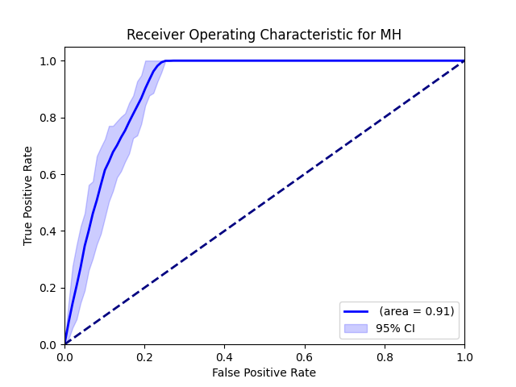
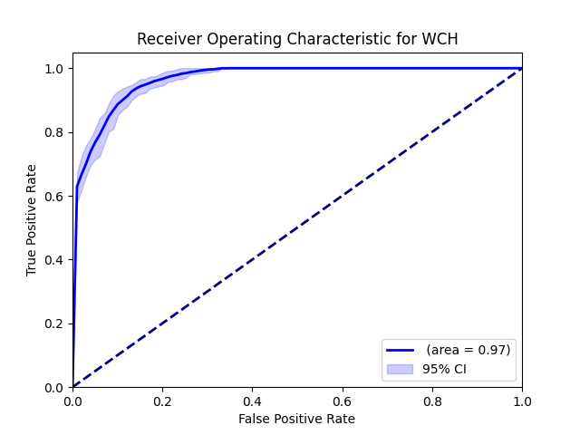

# Artificial Intelligence-Based Screening for Blood Pressure Phenotypes of White-coat and Masked Hypertension in Outpatient Settings
MING HUI HUNG, MD, Chun-Hung Chen, MD, Yu-Hsuan Tseng, MD, and Chin-Chou Huang, MD, PhD. Circulation 150, (Abstract) A4145524-A4145524 (2024). Now submitting the original paper...

## Introduction
White-coat hypertension (WCH) and masked hypertension (MH) complicate accurate blood pressure (BP) monitoring. While ambulatory BP monitoring (ABPM) is effective, its high cost and limited availability are significant barriers.
Hypothesis: We hypothesized that a machine learning (ML) model using clinical data from a single outpatient visit could accurately predict WCH and MH.

## Aims
This study aimed to develop and validate ML-based prediction models for WCH and MH using accessible clinical data to improve diagnostic efficiency and accessibility.

## Methods
We enrolled patients from two hypertension cohorts, after excluding those with incomplete data. Patients were classified by office BP and ABPM readings per American Heart Association guidelines. ML models, including Multi-layer Perceptron （MLP）, Support Vector Machine (SVM), and Tabular Prior-Data Fitted Network (Tab-PFN), were developed. Input parameters included demographic data (age, gender, height, weight, smoker), and office BP (OBP) and heart rate measurements. Principal Component Analysis (PCA), kernel PCA (kPCA), or t-distributed stochastic neighbor embedding (t-SNE) were used to improve class separability.

## Results
The study population comprised 1481 participants with a mean age of 47.6 years (SD 13.6), 65% of whom were male and 20.1% were smokers. OBP measurements showed a mean systolic BP (SBP) of 128.7 mmHg (SD 15.4) and a mean diastolic BP (DBP) of 84.2 mmHg (SD 11.6). ABPM showed a mean 24-hour systolic BP of 122.5 mmHg (SD 11.8) and diastolic BP of 79.3 mmHg (SD 10.1). The inclusion of demographic and OBP data, along with advanced resampling and dimensionality reduction techniques, significantly improved the model’s predictive ability. The final TabPFN model achieved the best performance with recall, precision, F1 score, and accuracy of 0.747, 0.931, 0.829, and 0.807 for WCH, and 0.713, 0.954, 0.816, and 0.907 for MH.

## Conclusion
Our ML-based model effectively predicts WCH and MH using accessible clinical data, offering a cost-effective alternative before applying ABPM.